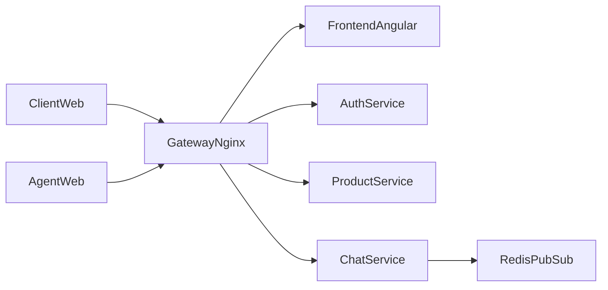
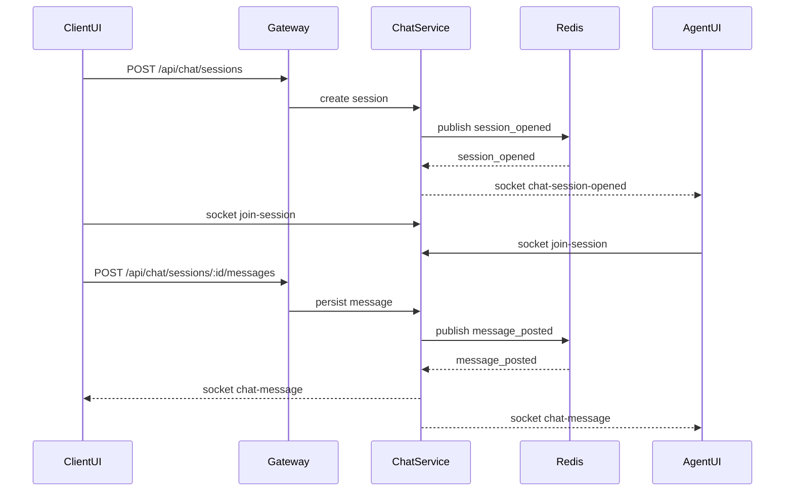

# Architecture PoC Chat

## 1) Contexte et perimetre PoC V1

Le PoC valide la faisabilite d une architecture microservices orientee chat client/conseiller.  
Le perimetre V1 se concentre sur:

- une page d accueil (catalogue + FAQ),
- un chat client,
- un espace service client (agent) avec liste de conversations, filtre/tri et reprise de session.

References de cadrage:

- [CDC poc chat](/home/laurent/projet7/CDC%20poc%20chat.md)
- [Architecture cible](/home/laurent/projet7/architecture.md)
- [README technique PoC](/home/laurent/projet7/mon-projet-web/README.md)

Elements explicitement hors V1 (cible ulterieure):

- chatbot scenarise (V2),
- pipeline CI/CD complet versionne (workflows GitHub Actions, Terraform, manifests ArgoCD).

## 2) Vue d architecture globale

Le PoC deploie 6 composants:

- `frontend` (Angular),
- `gateway` (Nginx),
- `auth-service` (Node/Express),
- `product-service` (FastAPI),
- `chat-service` (Node/Express + Socket.IO),
- `redis` (Pub/Sub pour synchro chat realtime).

Fichiers d orchestration:

- [docker-compose](/home/laurent/projet7/mon-projet-web/docker-compose.yml)
- [gateway nginx](/home/laurent/projet7/mon-projet-web/gateway/nginx.conf)

## 3) Fonctionnalites et mapping technique

- **Accueil**
  - Donnees catalogue: `GET /api/products/cars`
  - Donnees FAQ: `GET /api/products/faq`
  - Code: [home.component.ts](/home/laurent/projet7/mon-projet-web/frontend/src/app/pages/home/home.component.ts), [api.service.ts](/home/laurent/projet7/mon-projet-web/frontend/src/app/shared/api.service.ts)
- **Authentification demo**
  - Login: `POST /api/auth/login`
  - Profil: `GET /api/auth/profile`
  - Code: [auth app](/home/laurent/projet7/mon-projet-web/microservices/auth-service/src/app.js)
- **Chat client**
  - Creation session: `POST /api/chat/sessions`
  - Envoi message: `POST /api/chat/sessions/:sessionId/messages`
  - Historique session: `GET /api/chat/sessions/:sessionId/messages`
  - Code: [chat.component.ts](/home/laurent/projet7/mon-projet-web/frontend/src/app/pages/chat/chat.component.ts), [chat app](/home/laurent/projet7/mon-projet-web/microservices/chat-service/src/app.js)
- **Espace agent**
  - Liste sessions: `GET /api/chat/sessions`
  - Ouverture session + messages realtime Socket.IO
  - Code: [agent.component.ts](/home/laurent/projet7/mon-projet-web/frontend/src/app/pages/agent/agent.component.ts), [chat index](/home/laurent/projet7/mon-projet-web/microservices/chat-service/src/index.js)

## 4) Detail par composant

### Frontend Angular

Responsabilites:

- routage principal des ecrans (`/`, `/chat`, `/agent`),
- appels API via `/api`,
- gestion websocket `/socket.io` pour le temps reel chat.

Fichiers:

- [routes](/home/laurent/projet7/mon-projet-web/frontend/src/app/app.routes.ts)
- [service API](/home/laurent/projet7/mon-projet-web/frontend/src/app/shared/api.service.ts)
- [page chat](/home/laurent/projet7/mon-projet-web/frontend/src/app/pages/chat/chat.component.ts)
- [page agent](/home/laurent/projet7/mon-projet-web/frontend/src/app/pages/agent/agent.component.ts)

### Gateway Nginx

Responsabilites:

- exposition unique sur `:8081`,
- routage vers microservices (`/api/auth`, `/api/products`, `/api/chat`),
- proxy websocket Socket.IO (`/socket.io`).

Fichier:

- [nginx.conf](/home/laurent/projet7/mon-projet-web/gateway/nginx.conf)

### Auth Service

Responsabilites:

- endpoint de sante,
- login demo client/agent avec emission JWT,
- resolution profil depuis token.

Endpoints:

- `GET /health`
- `POST /login`
- `GET /profile`

Fichiers:

- [app auth](/home/laurent/projet7/mon-projet-web/microservices/auth-service/src/app.js)
- [entrypoint](/home/laurent/projet7/mon-projet-web/microservices/auth-service/src/index.js)

### Product Service

Responsabilites:

- exposer un catalogue minimal de voitures (villes FR avec aeroport),
- exposer une FAQ minimale (10 Q/R).

Endpoints:

- `GET /health`
- `GET /cars`
- `GET /faq`

Fichier:

- [main.py](/home/laurent/projet7/mon-projet-web/microservices/product-service/src/main.py)

### Chat Service

Responsabilites:

- gestion des sessions de chat et messages,
- publication d evenements sur Redis,
- diffusion realtime via Socket.IO (rooms par `sessionId`).

Endpoints:

- `GET /health`
- `GET /api/chat/sessions`
- `POST /api/chat/sessions`
- `GET /api/chat/sessions/:sessionId/messages`
- `POST /api/chat/sessions/:sessionId/messages`

Fichiers:

- [app chat](/home/laurent/projet7/mon-projet-web/microservices/chat-service/src/app.js)
- [runtime Redis/Socket.IO](/home/laurent/projet7/mon-projet-web/microservices/chat-service/src/index.js)

### Redis Pub/Sub

Responsabilites:

- canal `chat-events` pour synchroniser les evenements `session_opened` et `message_posted` entre logique applicative et diffusion temps reel.

Definition runtime:

- [chat-service index](/home/laurent/projet7/mon-projet-web/microservices/chat-service/src/index.js)
- [compose redis](/home/laurent/projet7/mon-projet-web/docker-compose.yml)

## 5) Flux chat temps reel

Flux nominal:

1. Le client cree une session (`POST /api/chat/sessions`).
2. Le `chat-service` enregistre la session en memoire et publie `session_opened` dans Redis.
3. Le service ecoute Redis et emet `chat-session-opened` en Socket.IO.
4. Le client/agent rejoignent une room `sessionId` via `join-session`.
5. Un message est poste (`POST /api/chat/sessions/:sessionId/messages`).
6. Le `chat-service` publie `message_posted` dans Redis.
7. Le subscriber Redis emet `chat-message` vers la room du chat.

## 6) Tests et validation

Tests unitaires presents:

- Auth: [auth.test.js](/home/laurent/projet7/mon-projet-web/microservices/auth-service/test/auth.test.js)
- Chat: [chat.test.js](/home/laurent/projet7/mon-projet-web/microservices/chat-service/test/chat.test.js)
- Product: [test_main.py](/home/laurent/projet7/mon-projet-web/microservices/product-service/tests/test_main.py)
- Front minimal: [app.component.spec.ts](/home/laurent/projet7/mon-projet-web/frontend/src/app/app.component.spec.ts)

Test E2E:

- [run-e2e.sh](/home/laurent/projet7/mon-projet-web/e2e/run-e2e.sh)
- Valide de bout en bout: auth -> profile -> cars -> faq -> creation session chat -> envoi message -> lecture messages.

## 7) Pipeline CI/CD

### Etat actuel dans le repo

Pour `mon-projet-web`, les elements suivants ne sont pas encore versionnes:

- workflows GitHub Actions (`.github/workflows`),
- code Terraform (`*.tf`),
- manifests/projets ArgoCD.

En revanche, la documentation de pre-requis CD est deja presente:

- [README section secrets CD](/home/laurent/projet7/mon-projet-web/README.md)

### Pipeline cible (cadrage)

Conformement au cadrage projet:

- CI/CD base GitHub Actions,
- provisioning infra via Terraform (state S3),
- deploiement applicatif et synchronisation via ArgoCD sur AWS.

References de cadrage CD:

- [CDC poc chat - bloc devops](/home/laurent/projet7/CDC%20poc%20chat.md)
- [architecture.md - sections architecture microservices et CI/CD](/home/laurent/projet7/architecture.md)

### Prerequis secrets

Les secrets/variables necessaires (AWS OIDC ou cles statiques, DockerHub, Terraform state, ArgoCD) sont documentes dans:

- [README secrets GitHub pour le CD](/home/laurent/projet7/mon-projet-web/README.md)
