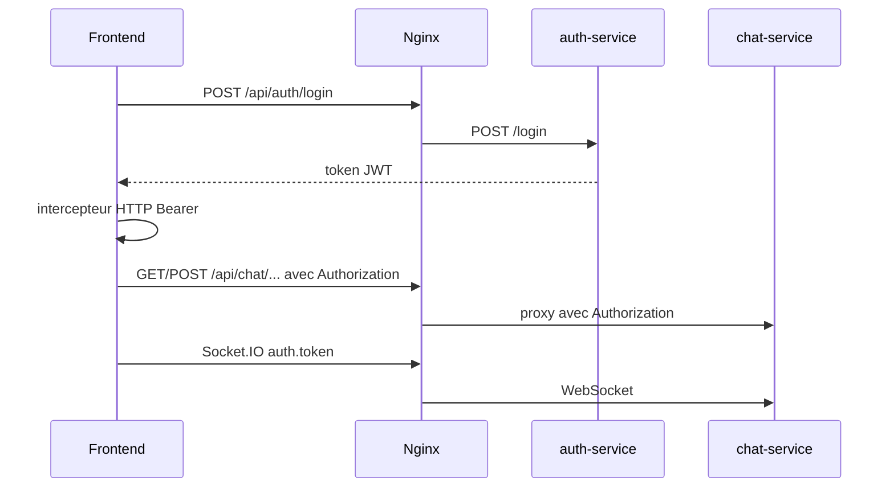

# Audit de sécurité — PoC mon-projet-web

**Audit initial** : 3 mai 2026  
**Révision (réaudit)** : 4 mai 2026  
**Périmètre** : frontend Angular, auth-service, chat-service, product-service (FastAPI), gateway Nginx, Redis, Docker Compose, Terraform AWS, GitHub Actions CI.  
**Méthode** : revue de code et configuration, OWASP Top 10 (2021) et ASVS niveau 1 ciblé, `npm audit`, `pip-audit`, corrélation avec la CI (Trivy, E2E). Aucun pentest intrusif.

**Note de lecture** : le rapport du 3 mai 2026 décrivait surtout des **écarts avant remédiation**. La présente révision constate les **correctifs en place** dans le dépôt et liste les **risques résiduels**.

---

## 1. Synthèse exécutive

Depuis l’audit initial, les **failles critiques** sur le chat (API et WebSocket sans authentification, JWT ignoré côté front, secrets Terraform non injectés, bootstrap EC2 incohérent) ont été **largement traitées** dans le code et la CI.

**Constat actuel** :

- Le chat **exige un JWT** sur les routes REST ; les sessions sont liées au **`sub`** du client ; les messages utilisent **rôle et nom issus du token** ; Socket.IO authentifie la connexion et restreint `join-session` ; CORS est basé sur **`ALLOWED_ORIGINS`** ; la gateway Nginx propage **`Authorization`** et applique **rate limiting** sur le login, des **en-têtes de sécurité** et une limite de corps.
- Le déploiement Terraform s’appuie sur un **`user-data.sh.tftpl`** (réseau Docker, Redis, services, gateway sur le **port 80** aligné avec le security group) et une **precondition** sur la longueur du `jwt_secret`.
- La CI exige un **`JWT_SECRET`** fort en secret GitHub, exécute **tests unitaires**, **E2E Docker Compose**, **Trivy (fs)** avant tout push d’images conditionnel.

**Risques résiduels** (à traiter pour un environnement **exposé sur Internet** au-delà du PoC) :

- **Transport** : pas de TLS dans la configuration Nginx versionnée (dépend d’un terminateur externe ou d’une évolution du repo).
- **Démonstration** : comptes `client` / `agent` toujours **prévisibles** ; empreintes scrypt **versionnées** (pas d’équivalent production avec gestion de comptes).
- **Secrets locaux** : `JWT_SECRET` par défaut dans Docker Compose pour le labo (`dev-secret-change-me` si non surchargé).
- **Réseau** : variables Terraform `ssh_allowed_cidr` / `http_allowed_cidr` toujours larges par défaut (`0.0.0.0/0`).
- **Supply chain** : `npm audit` sur le **frontend** remonte encore des vulnérabilités en **devDependencies** (chaîne de build) ; Trivy en CI complète ce signal sur le dépôt.
- **Conformité** : pas d’analyse RGPD / registre des traitements dans ce document.

**Verdict** : *PoC / labo avec README et secrets explicites* — **acceptable** si l’accès réseau est limité. *Service grand public* — il reste des **chantiers** (TLS, identités fortes, durcissement réseau, rotation des secrets hors repo, WAF optionnel).

---

## 2. Cartographie des flux

### 2.1 Authentification (JWT) et chat



- **Login** : `POST /api/auth/login` — vérification mot de passe par **scrypt** (empreintes versionnées), émission JWT (`expiresIn: 8h`). Fichier : [`microservices/auth-service/src/app.js`](microservices/auth-service/src/app.js).
- **Profil** : `GET /api/auth/profile` avec `Authorization: Bearer …`.
- **Chat HTTP** : toutes les routes sous `/api/chat/` (sauf health) passent par un **middleware JWT** ; création de session **réservée au rôle `client`** avec enregistrement **`ownerSub`** ; liste des sessions **`agent` uniquement`** ; messages et lecture : **agent** ou **client propriétaire** ; corps des messages limité à **`{ content }`** — rôle et nom d’affichage tirés du token. Fichier : [`microservices/chat-service/src/app.js`](microservices/chat-service/src/app.js).
- **Frontend** : [`auth.interceptor.ts`](mon-projet-web/frontend/src/app/shared/auth.interceptor.ts), [`api.service.ts`](mon-projet-web/frontend/src/app/shared/api.service.ts) — token après login, socket avec `auth: { token }`.

### 2.2 Chat (REST + Socket.IO + Redis)

- **REST** : sessions en mémoire ; contrôle d’accès basé sur **JWT** et **`ownerSub`**.
- **Socket.IO** : origines depuis **`ALLOWED_ORIGINS`** ; handshake **`auth.token`** vérifié ; `join-session` autorisé pour un **agent** sur toute session existante, ou un **client** sur sa session (`ownerSub`).
- **Redis** : pub/sub inchangé ; en local, **plus de publication du port 6379** sur l’hôte dans [`docker-compose.yml`](mon-projet-web/docker-compose.yml).

### 2.3 Points d’entrée : Compose local vs Terraform

| Mode | Entrée utilisateur | Exposition hôte / réseau |
|------|-------------------|-------------------------|
| [`docker-compose.yml`](mon-projet-web/docker-compose.yml) | Gateway **8081** → 80 interne | **8081** (gateway) ; frontend **127.0.0.1:4200** ; Redis **non** mappé sur l’hôte |
| [`docker-compose-aws.yml`](mon-projet-web/docker-compose-aws.yml) | Gateway **80** | **80** uniquement ; Redis interne |
| Terraform [`main.tf`](mon-projet-web/terraform/main.tf) + [`user-data.sh.tftpl`](mon-projet-web/terraform/user-data.sh.tftpl) | **HTTP 80** (gateway) | SG ingress **22** + **80** cohérents avec le conteneur **gateway** (`-p 80:80`) ; réseau Docker interne ; **Redis** démarré ; **JWT** et **ALLOWED_ORIGINS** injectés (métadonnées EC2 + localhost pour CORS) |

---

## 3. Grille OWASP Top 10 (2021) — synthèse par composant

| ID OWASP | Thème | auth-service | chat-service | product-service | frontend | gateway / infra |
|----------|--------|----------------|--------------|-----------------|----------|------------------|
| A01 | Broken Access Control | Login public ; profil JWT | **JWT + rôles + `ownerSub`** sur REST et Socket | Catalogue public (vitrine) | Intercepteur Bearer sur API authentifiée | Nginx transmet Authorization ; ne remplace pas la logique métier |
| A02 | Cryptographic Failures | JWT HS256 ; secret CI obligatoire | Même secret que auth en runtime | HTTP dans le repo ; TLS à terminer en prod | HTTP sauf couche externe | Pas de TLS dans `nginx.conf` versionné |
| A03 | Injection | JSON basique | Pas de SQL ; contenu message non sanitisé (PoC) | FastAPI ; données statiques | — | — |
| A04 | Insecure Design | Comptes démo prévisibles | Modèle session–utilisateur présent | — | Flux demo login intégré | — |
| A05 | Security Misconfiguration | CORS liste `ALLOWED_ORIGINS` | CORS + Socket alignés sur la même liste | Pas de CORS explicite (API interne) | — | Headers `nosniff`, `X-Frame-Options`, `Referrer-Policy` ; `client_max_body_size` ; rate limit login |
| A06 | Vulnerable Components | Voir §5 | Voir §5 | **pip-audit : 0** (au 4 mai 2026) | **npm audit : 11** (devDeps, voir §5) | nginx:1.27-alpine ; Trivy CI |
| A07 | Identification / Auth | Scrypt pour mots de passe démo | Identification JWT obligatoire sur chat | Pas d’auth | Token utilisé après login | — |
| A08 | Software / Data Integrity | — | `JSON.parse` sur événements Redis (PoC) | — | Lockfiles + CI | Images taguées par SHA sur push main |
| A09 | Logging / Monitoring | Pas d’audit login détaillé | Pas de corrélation centralisée | Health | — | Rate limit login |
| A10 | SSRF | Non applicable majeur | — | — | — | — |

### 3.1 Évolution depuis l’audit du 3 mai 2026

Les écarts les plus sensibles de la première version du rapport (**chat ouvert**, **JWT absent des appels**, **CORS `*`**, **mots de passe en clair dans le source**, **Terraform / Redis / JWT incohérents**, **Nginx sans durcissement**, **CI avec fallback de secret faible**) ont été **adressés dans le code** référencé ci-dessus.

### 3.2 ASVS L1 (extraits pertinents)

| Chapitre ASVS | Exigence L1 | Constat (révision 4 mai 2026) |
|----------------|------------|--------------------------------|
| V2 — Authentification | Stockage des secrets d’authentification | Empreintes **scrypt** + sels versionnés (démo, pas annuaire prod) |
| V4 — Contrôle d’accès | Accès aux données contrôlé | Chat : **JWT + rôles + propriété de session** |
| V9 — Communication | TLS pour données sensibles en transit | **Non couvert** dans le dépôt Nginx ; à ajouter en bordure (ALB, etc.) |
| V10 — Malicious code | Dépendances suivies | **pip-audit** OK sur product ; **npm audit** frontend à suivre ; **Trivy** en CI |

---

## 4. Revue infrastructure, edge et CI/CD

### 4.1 Terraform AWS

**Positifs** : IMDSv2 obligatoire, volume racine chiffré, tags, **`user-data.sh.tftpl`** avec stack cohérente (Redis, services, gateway **80**), **`jwt_secret`** injecté (base64 dans le template), precondition **`length(jwt_secret) >= 16`**.

**Résiduels** : CIDR SSH/HTTP par défaut **`0.0.0.0/0`** ([`terraform/variables.tf`](mon-projet-web/terraform/variables.tf)) ; pas de TLS natif sur l’instance ; secrets encore passés par user-data (acceptable PoC, à migrer vers SSM / Secrets Manager en prod).

### 4.2 Nginx ([`gateway/nginx.conf`](mon-projet-web/gateway/nginx.conf))

**Présent** : `limit_req_zone` + location dédiée **`/api/auth/login`** ; `client_max_body_size` ; en-têtes **`X-Content-Type-Options`**, **`X-Frame-Options`**, **`Referrer-Policy`** ; **`Authorization`** vers auth, chat et Socket.IO.

**Résiduel** : pas de **HSTS** (normal tant que le TLS n’est pas terminé sur ce fichier) ; pas de CSP.

### 4.3 Docker Compose

Redis **sans** bind sur l’hôte ; frontend sur **127.0.0.1:4200** ; `JWT_SECRET` et `ALLOWED_ORIGINS` sur auth et chat. **Résiduel** : valeur par défaut **`dev-secret-change-me`** si `.env` absent (documenté pour le labo uniquement).

### 4.4 CI/CD et supply chain ([`.github/workflows/ci-cd.yml`](mon-projet-web/.github/workflows/ci-cd.yml))

Déclencheurs : **`push` / `pull_request`** (`main`, `master`) et **`workflow_dispatch`**.

| Job | Rôle |
|-----|------|
| `controle-secret-jwt` | Vérifie `JWT_SECRET` non vide et longueur **≥ 16** |
| `test-auth-chat` | Tests unitaires Node (auth + chat), après contrôle secret |
| `test-product` | Tests unitaires Python |
| `build-frontend` | Build Angular |
| `test-e2e` | Script [`e2e/run-e2e.sh`](mon-projet-web/e2e/run-e2e.sh) (Compose + flux gateway) |
| `trivy-scan` | **Trivy fs** (`aquasecurity/trivy-action@0.36.0`), sévérités CRITICAL/HIGH, `ignore-unfixed`, `skip-dirs` pour réduire le bruit |
| `docker-build-and-push` | Uniquement sur **push `main`**, si variables DockerHub ; **`needs`** inclut tests + E2E + Trivy |

---

## 5. Dépendances (`npm audit` / `pip-audit`) — exécution du 4 mai 2026

### 5.1 auth-service et chat-service

`npm audit` : **0 vulnérabilité** dans chaque service (dépendances de prod minimales).

### 5.2 frontend (Angular 19)

`npm audit` : **11 vulnérabilités** (**5 modérées**, **6 hautes**), principalement chaîne **devDependencies** (`@angular-devkit/build-angular`, `webpack-dev-server`, `tar`, `postcss`, `serialize-javascript`, etc.). **Lecture risque** : surface surtout **poste développeur / `ng serve` / CI build** ; bundle de prod moins directement exposé si la chaîne de build est saine.

**Action recommandée** : `npm audit fix`, montées de version contrôlées du toolchain Angular, suivi régulier.

### 5.3 product-service

`pip-audit -r requirements.txt` : **aucune vulnérabilité connue** au moment du scan.

Stack déclarée : **FastAPI 0.123.10** (transitive **Starlette** récente par rapport à l’audit initial qui ciblait FastAPI 0.115.12).

---

## 6. Tableau des findings

### 6.1 Findings historiques — statut **remédié** (traçabilité)

| ID | Sévérité d’origine | Statut | Résumé de la remédiation |
|----|--------------------|--------|---------------------------|
| F-01 | Critique | **Remédié** | JWT obligatoire sur toutes les routes chat protégées ; règles par rôle et `ownerSub` |
| F-02 | Critique | **Remédié** | Socket.IO : `auth.token`, CORS restreint, `join-session` contrôlé ; `session_opened` vers room agents |
| F-03 | Élevé | **Remédié** | Mots de passe démo : vérification **scrypt** + empreintes (plus de comparaison en clair) |
| F-04 | Élevé | **Remédié** | Intercepteur HTTP + token Socket après login |
| F-05 | Élevé | **Remédié** | Terraform : `jwt_secret` passé au bootstrap (base64 dans `user-data.sh.tftpl`) |
| F-06 | Élevé | **Remédié** | User-data : Redis + gateway **port 80** aligné SG ; plus les anciens `docker run` fragmentés incohérents |
| F-08 | Moyen | **Remédié** | Compose : Redis non exposé hôte ; frontend en **127.0.0.1:4200** |
| F-10 | Moyen | **Partiellement remédié** | Headers de sécurité, `client_max_body_size`, rate limit login ; **TLS / HSTS** toujours hors scope fichier |
| F-11 | Faible | **Remédié** | Rate limit Nginx sur `/api/auth/login` |
| F-12 | Faible–Moyen | **Partiellement remédié** | **product** : dépendances à jour, **pip-audit** clean ; **frontend** : vulnérabilités devDeps toujours présentes ; **Trivy** ajouté en CI |

### 6.2 Findings **ouverts** ou **atténués** (suivi)

| ID | Sévérité | Sujet | Description | Piste |
|----|----------|--------|-------------|--------|
| R-01 | Moyen | Transport | Pas de TLS dans `nginx.conf` | ALB/ACM, Caddy, ou Nginx + certificats |
| R-02 | Moyen | Réseau Terraform | `ssh_allowed_cidr` / `http_allowed_cidr` **0.0.0.0/0** par défaut | Restreindre par IP / bastion / VPN |
| R-03 | Moyen | Auth démo | Comptes et mots de passe **connus** ; empreintes dans le repo | OIDC / annuaire ; retirer démo en prod |
| R-04 | Faible–Moyen | Secrets locaux | Défaut `JWT_SECRET` dans compose si oubli `.env` | Forcer échec au démarrage sans secret en prod |
| R-05 | Faible–Moyen | Supply chain frontend | **11** findings `npm audit` (devDeps) | Mises à jour ; éventuel `npm audit` en gate CI avec seuil |
| R-06 | Faible | Exploitation / forensics | Peu de logs structurés (login, décisions d’accès) | Journalisation centralisée, corrélation `sub` / session |
| R-07 | Info | Conformité | RGPD / DPIA non couverts ici | Hors périmètre technique de ce PoC |

*(Alignement Terraform / Redis / ports : **F-06** remédié. CIDR **0.0.0.0/0** SSH/HTTP : ancien **F-07**, toujours pertinent — voir **R-02**.)*

---

## 7. Scénarios d’abus (mis à jour)

1. ~~Lecture anonyme de toutes les sessions via REST~~ : **mitigé** — sans JWT valide (rôle adapté), les réponses sont **401/403**.
2. ~~Usurpation du nom / rôle via le corps des messages~~ : **mitigé** — le serveur impose **rôle et nom depuis le JWT**.
3. **Token JWT volé** (XSS, fuite logs, poste compromis) : accès **identique à l’utilisateur** jusqu’à expiration ; surface **XSS** côté front reste un sujet classique (CSP non définie dans Nginx).
4. **Mauvaise configuration `ALLOWED_ORIGINS`** : CORS / Socket refusés pour le navigateur, ou liste **trop large** si mal renseignée en prod.
5. **`JWT_SECRET` faible ou divulgué** : forge de tokens ; mitigé en **CI** (secret obligatoire) et en **Terraform** (longueur minimale) ; reste le **défaut compose** en labo.
6. **Déni de service** sur `/login` : partiellement **limité** par Nginx ; toujours possible en volume depuis de nombreuses IP si SG trop ouvert.
7. **Redis** : non exposé sur l’hôte en compose actuel ; risque si une autre config réexpose le port.

---

## 8. Backlog priorisé (état au 4 mai 2026)

### Réalisé (extraits — aligné avec le code actuel)

- Contrôle d’accès **chat** (REST + Socket) avec **JWT**.
- **Intercepteur** Angular et **auth** Socket.
- **Scrypt** pour les mots de passe démo ; **CORS** explicite.
- **Nginx** : headers, taille corps, **rate limit login**, **Authorization** proxifiée.
- **Compose** : Redis non publié ; frontend **localhost** ; variables **JWT** / **ALLOWED_ORIGINS** sur chat.
- **Terraform** : bootstrap cohérent + **JWT** injecté + precondition longueur secret.
- **CI** : secret **JWT** obligatoire, **E2E**, **Trivy**, enchaînement avant push Docker conditionnel.
- **FastAPI** monté en **0.123.10** (réduction risque Starlette obsolète).

### À poursuivre (chantiers)

- **TLS** bout-en-bout et **HSTS** lorsque le certificat est géré.
- **CIDR** Terraform et exposition **SSH** selon le modèle d’administration réel.
- **Secrets** : AWS Secrets Manager / SSM + rotation ; suppression du défaut compose en environnements sensibles.
- **Identités** : OIDC / fournisseur d’identité ; suppression des comptes démo en prod.
- **Frontend** : réduction des **11** vulnérabilités `npm audit` (devDeps) ; option **CSP**.
- **Durcissement applicatif** : validation / filtrage du contenu chat ; schéma strict des messages Redis.

---

## 9. Annexes

### 9.1 Commandes utiles

```bash
cd mon-projet-web/microservices/auth-service && npm audit
cd mon-projet-web/microservices/chat-service && npm audit
cd mon-projet-web/frontend && npm audit
cd mon-projet-web/microservices/product-service && pip-audit -r requirements.txt
```

### 9.2 Vérification manuelle rapide (contre-régression accès chat)

```bash
# Sans Bearer : doit répondre 401
curl -s -o /dev/null -w "%{http_code}" http://localhost:8081/api/chat/sessions

# Avec token client (après login) : 200 pour liste interdite au client → 403 attendu sur GET /sessions ; POST /sessions avec client OK
```

### 9.3 Référence CI

Workflow : [`.github/workflows/ci-cd.yml`](mon-projet-web/.github/workflows/ci-cd.yml) — jobs **unitaires**, **E2E**, **Trivy**, **docker-build-and-push** conditionnel.

---

*Fin du rapport — révision du 4 mai 2026.*
